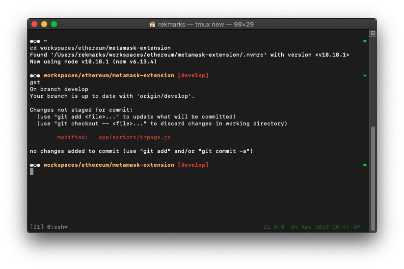

# 🛠 dotfiles

## usage

- Platform
  - **macOS**
- For reloading `.zshrc` without restarting
  - `so`
  - Note that `exit` and restart is recommended
- For reloading `.vimrc` without restarting vim
  - `:so ~/.vimrc`
- To migrate dotfiles
  - `yarn m`

### TODO

- Disable `pyenv-virtualenv` prompt manipulation; add to OMZ theme
- `echo` `git` editor command output? (e.g. `git diff`)

## recovery

- First
  - Install `homebrew` from [brew.sh](https://brew.sh)
    - `brew install yarn`
  - Oh My ZSH!
    - `sh -c "$(curl -fsSL https://raw.githubusercontent.com/ohmyzsh/ohmyzsh/master/tools/install.sh)"`
- Then, attempt automatic reinstall
  - `yarn i`
  - If the script fails, see contents for manual steps
- Finally
  - In a running instance of `nvim`
    - `:PlugInstall`
    - `:so ~/.vimrc` or restart `nvim`
  - GPG signing
    - [download](https://gpgtools.org/)
    - If you were smart and saved your GPG key, you can reuse it
    - Whatever the case, follow [these instructions](https://help.github.com/en/articles/managing-commit-signature-verification)

### notes

- Check that the desired versions are listed in `scripts/install/install_python.sh`

## packages used

- [Homebrew](https://brew.sh)
- [Neovim](https://neovim.io/)
  - [vim-plug](https://github.com/junegunn/vim-plug)
- [NVM](https://github.com/nvm-sh/nvm)
- [Oh My ZSH!](https://ohmyz.sh/)
- [pyenv](https://github.com/pyenv/pyenv)
  - [pyenv-virtualenv](https://github.com/pyenv/pyenv-virtualenv)
- [tmux](https://github.com/tmux/tmux/)
  - [TPM](https://github.com/tmux-plugins/tpm)
